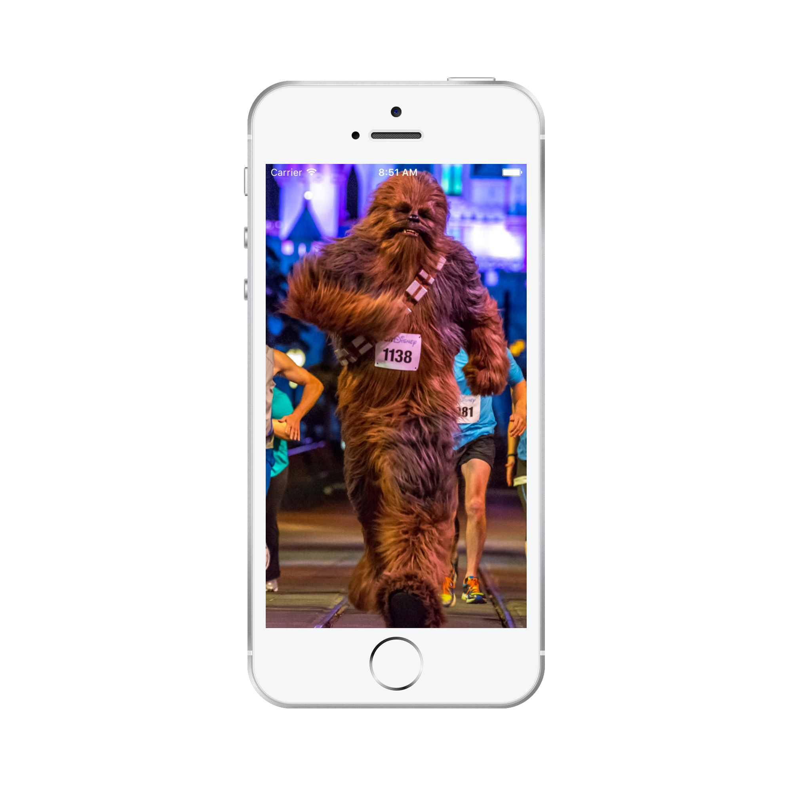
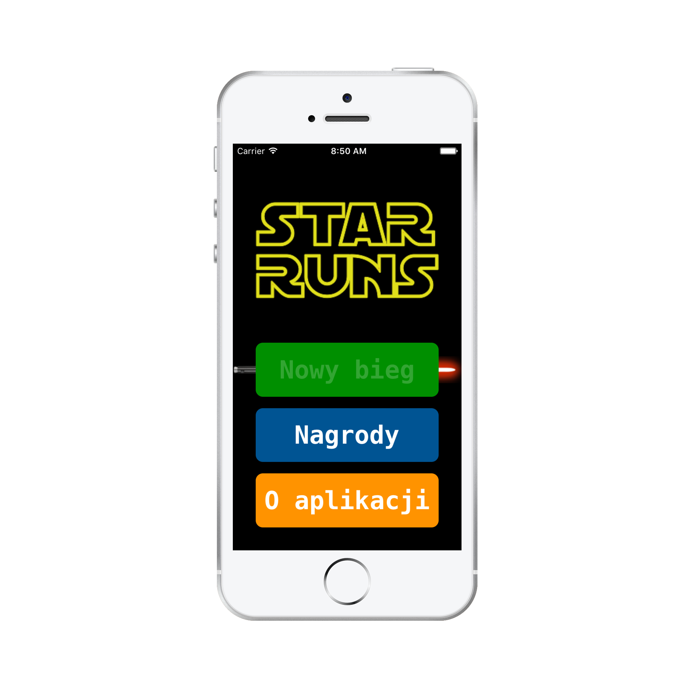
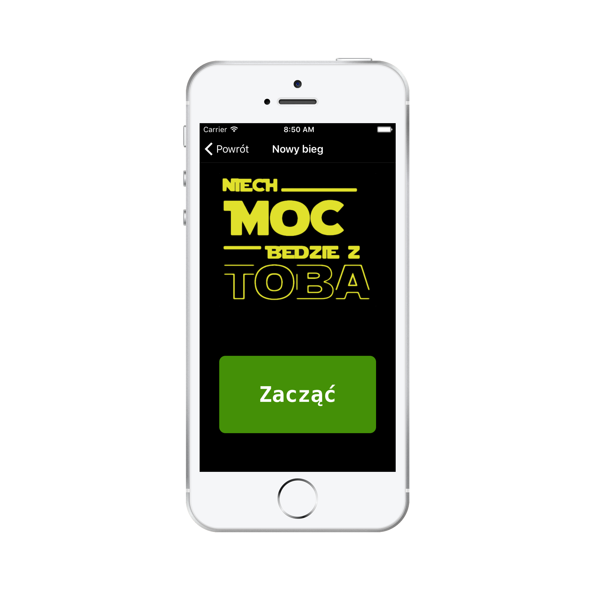
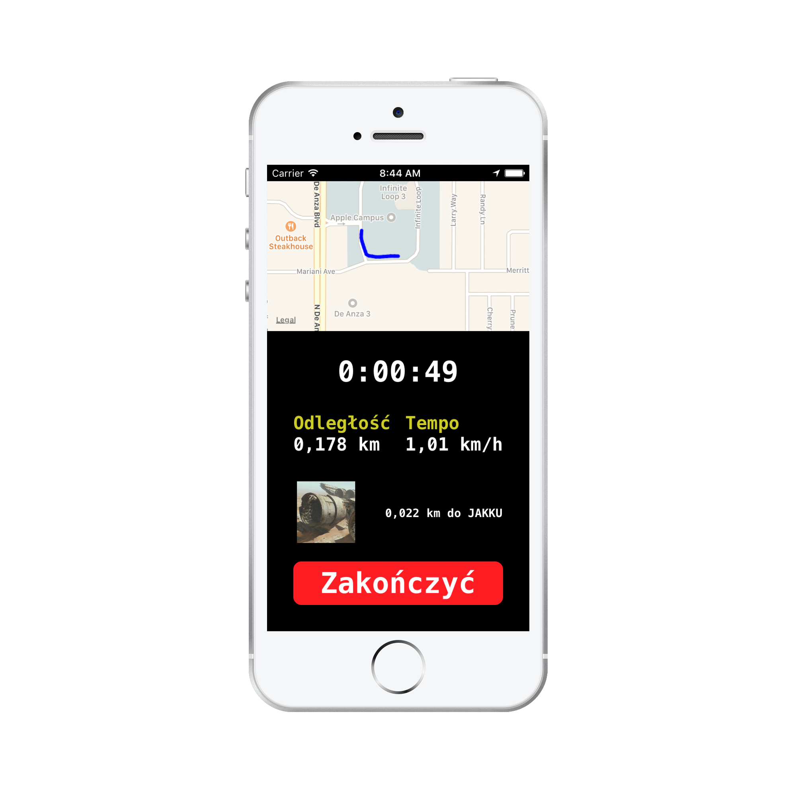
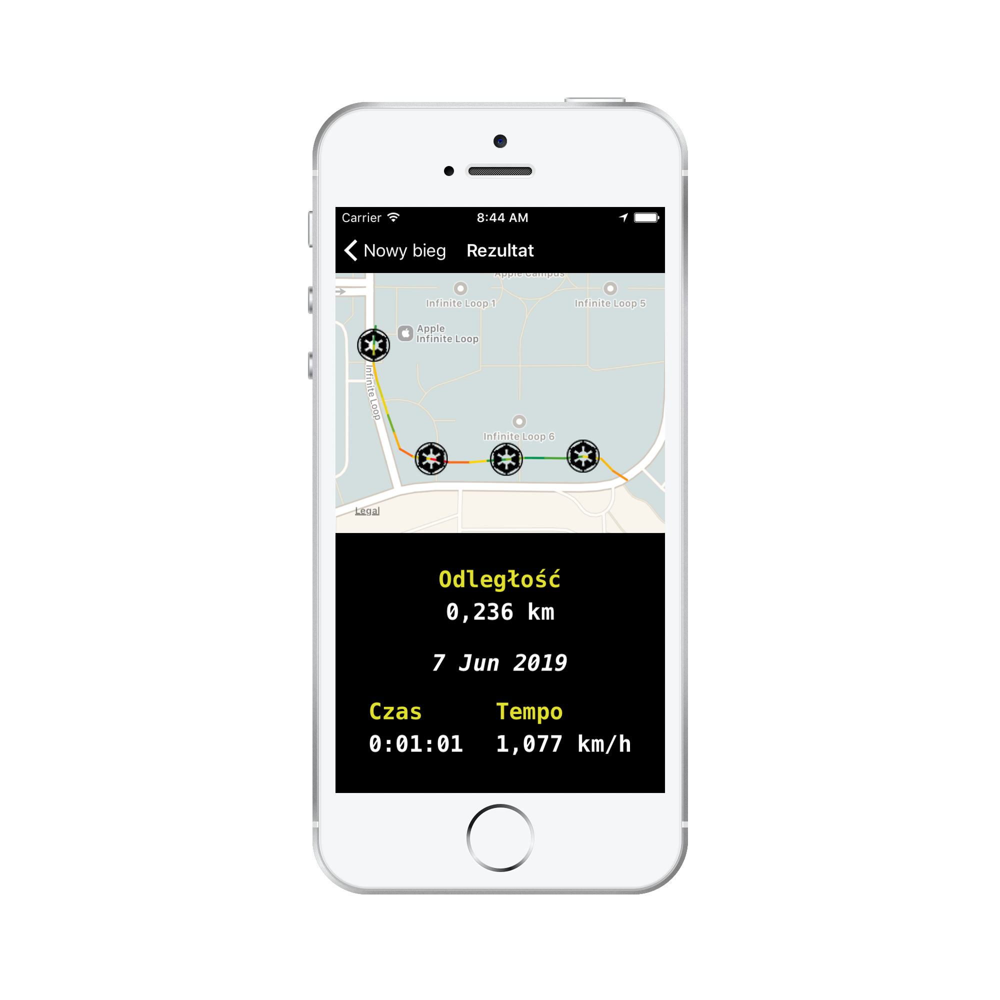
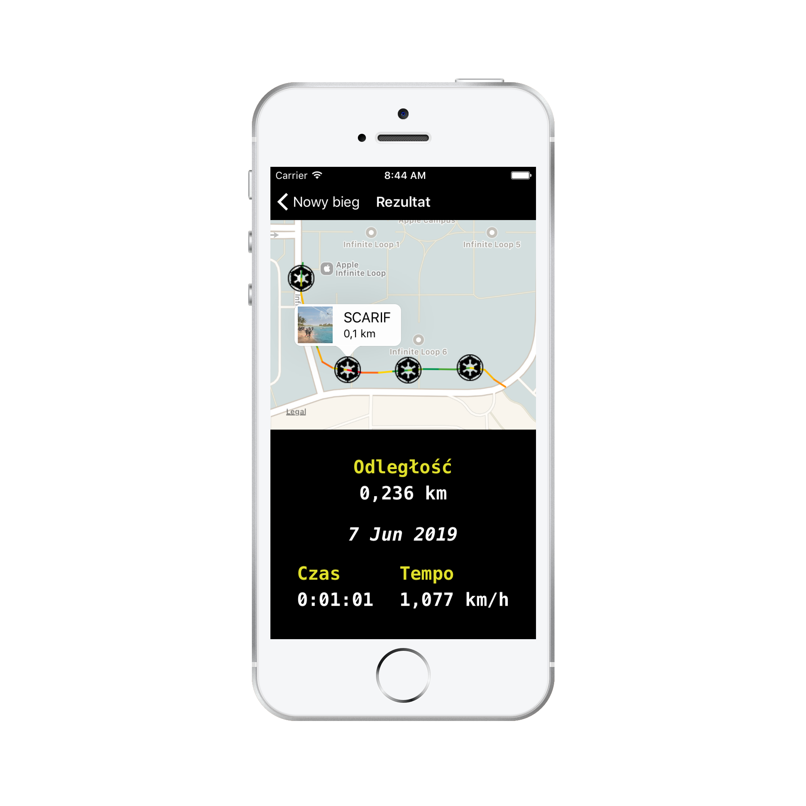
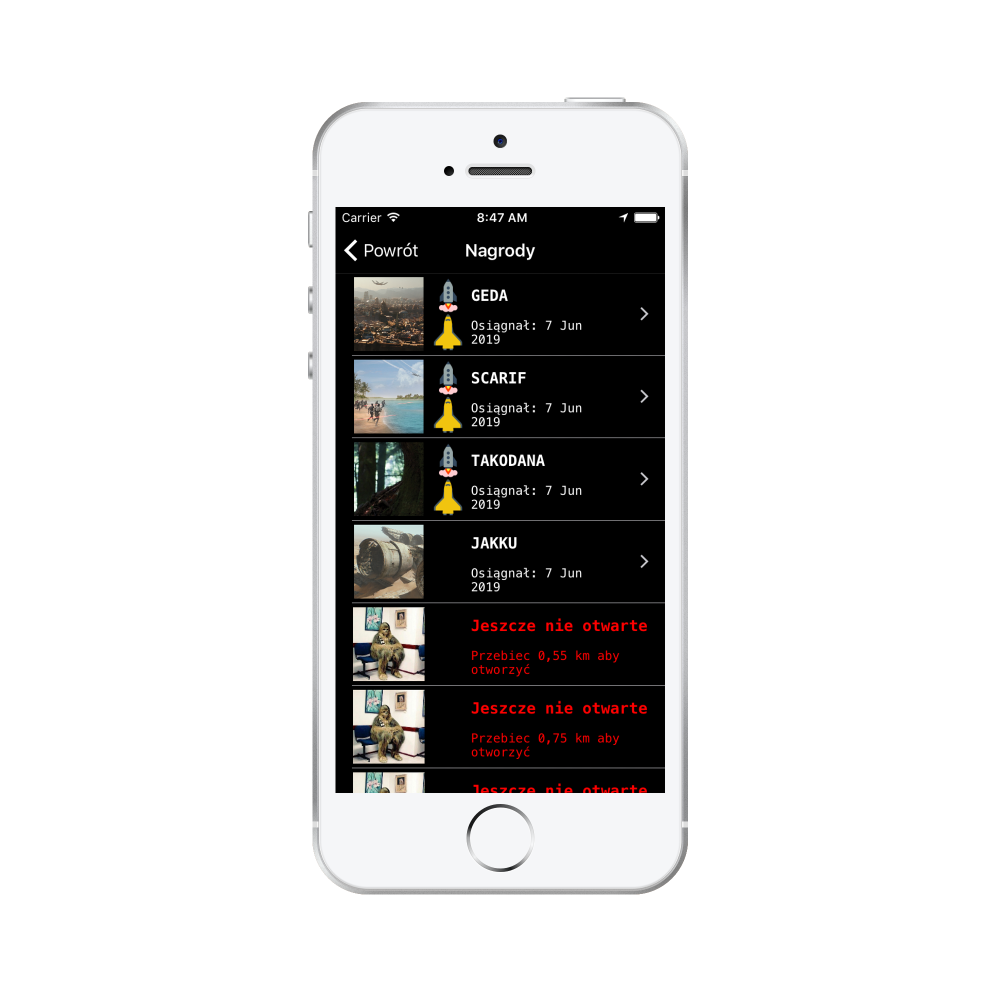
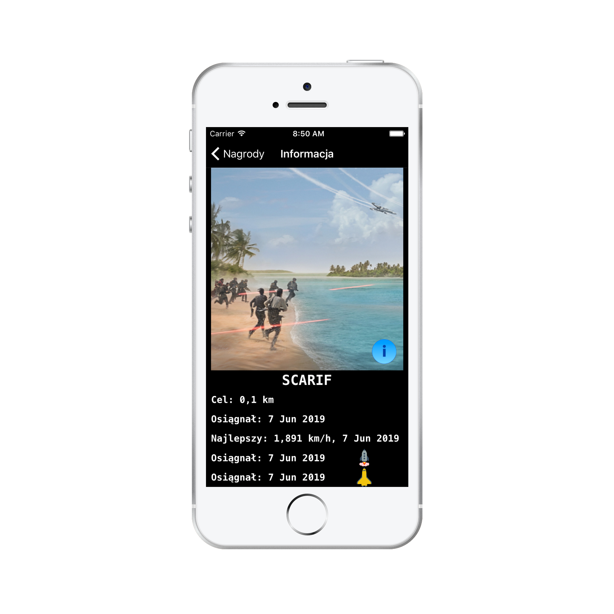
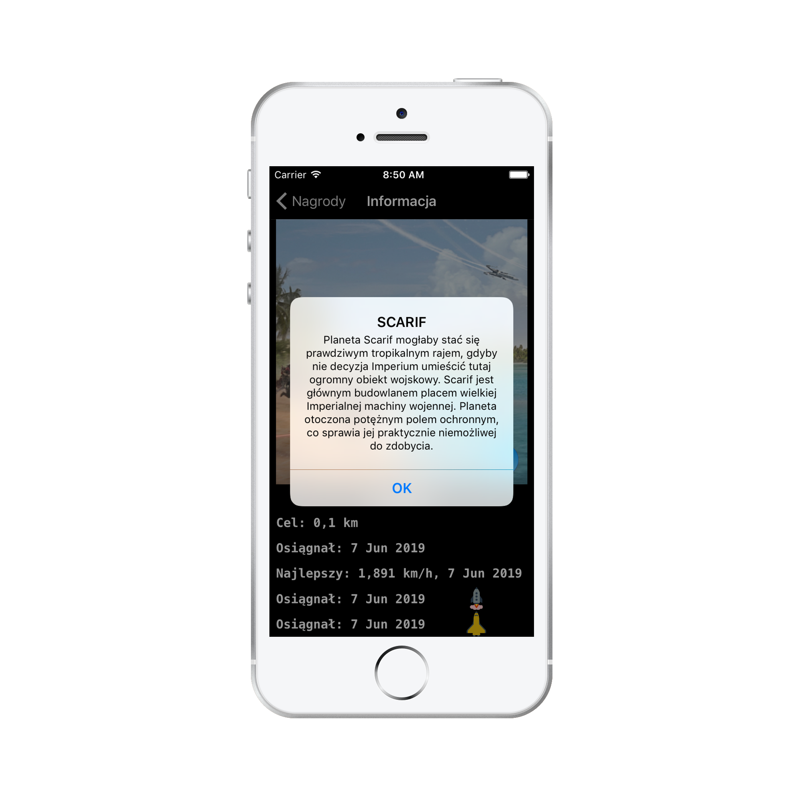
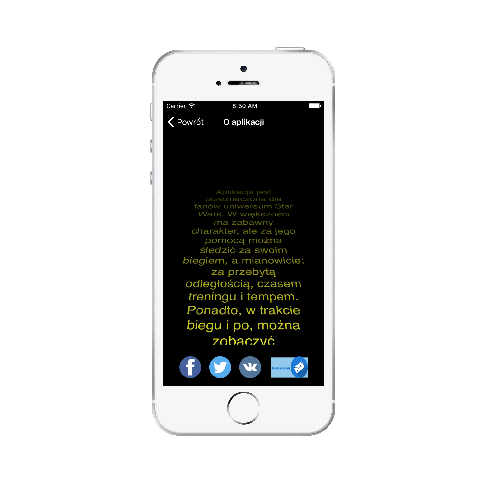

# Star Runs
Application was created for fans of the Star Wars universe. For the most part, it's a funny app, but with its help, you can tracking your running (distance, time, pace). In addition, in real-time or after the running you can see detailed running report, including the map and the route. A route is marked on the map with a colored line (red - worst pace, green - best pace) and badges. Each badge is given for achieving some result. In total, the application contains 30 badges. After earning each of them, you will learn about the interesting places and planets of the Star Wars universe, which should motivate you. In the appropriate menu, you will be able to see all badges that you have been already achieved and those that you can only find. The badges menu also includes detailed statistic about circumstances in which each badge was achieved.

### What I learned
* Core Data
* Core Location
* Converting values by UnitConverter class
* Formatting values by user location
* MapKit
* Show only some region on the map
* Drawing a route on the map
* Show annotation on the map
* Get data from the JSON file
* Play sounds
* Timer
* Data persistent
* Working with WebView
* Managing, editing and sending an email from the app

### Used 3rd party libraries
➖

### Programming language
Swift 5

|  |  |
| ------------- | ------------- |
|  |  |
|  |  |
|  |  |
|  |  |
